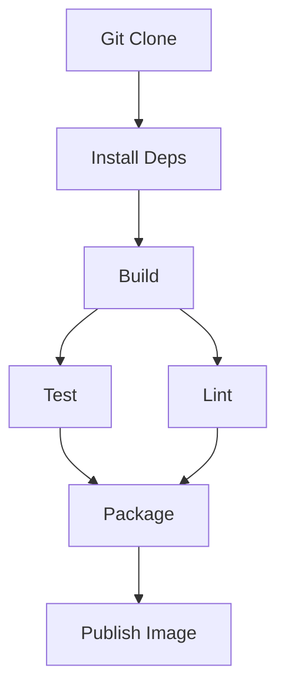

+++
weight = 30
+++



{}

# /ARCHITECTURE

---

### /DAG = Directed Acyclic Graph

- Directed: from one step to another
- Acyclic: No cycles — you can’t return to a previous step

---

### /Dagger

- Every operation in your pipeline becomes a node in a DAG.
- Dependencies (e.g., "compile → then test") form edges between nodes.
- Dagger resolves this DAG and executes the steps efficiently — with caching.

---

### /DAGGER ENGINE

- The Dagger engine is a custom version of BuildKit
- It is responsible for efficiently running your pipeline as a DAG
- It's shipped as a container image and runs as a privileged container.

---

### /🎯 Dagger's GraphQL API spec
- You write code in Go/Python/Node using a Dagger SDK.
- That code sends GraphQL queries to a running Dagger engine (inside a container).
- The engine interprets the queries, builds the DAG of container operations, executes it, and returns results.

---

### /🎯 Why GraphQL?

- GraphQL is strongly typed and introspectable (perfect for generating SDKs).
- Lets you dynamically compose and query complex objects (like containers and filesystems).
- Supports lazy evaluation — only the final outputs you need get computed.

---

### /Example: Go SDK Query

- Write code in a Dagger SDK
- It gets converted into a GraphQL query

---

### /Example: Go SDK Query

- The Dagger engine resolves it into a declarative build graph
- Containers run logic, results stream back via GraphQL

---

### /Cross-Language Support

- 🐹 Go (`github.com/dagger/dagger`)
- 🐍 Python (`dagger-io/dagger-python`)
- 🕸️ Node.js / TypeScript (`@dagger.io/dagger`)

---

### /Cross-Language Support

- All SDKs talk to the **same GraphQL engine**
- ➡️ Language doesn't matter, pipelines behave the same
- You can reuse and compose pipeline logic across teams and stacks.

{}
