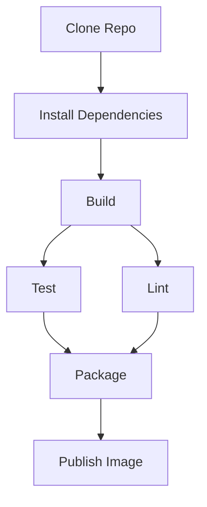

+++
weight = 30
+++



{}

# /ARCHITECTURE

### /DAG



---

- DAG = Directed Acyclic Graph
- Graph to model dependencies and workflows
- Directed: The connections (edges) between steps (nodes) point in one direction — from one step to another.
- Acyclic: No cycles — you can’t return to a previous step by following edges.

---

### /Dagger

- Every operation in your pipeline (build, test, copy file, run command) becomes a node in a DAG.
- Dependencies (e.g., "compile → then test") form edges between nodes.
- Dagger resolves this DAG and executes the steps efficiently — with caching.

---

### /DAGGER ENGINE

- The Dagger engine is a custom version of BuildKit
- It is responsible for efficiently running your pipeline as a DAG (Directed Acyclic Graph)
- It's shipped as a container image and runs as a privileged container.

---

###  /Dagger CLI
The Dagger CLI is the interface between you and the Dagger engine. It's used to call a module function, among many other things. It requires a container runtime to bootstrap the Dagger engine. Once the bootstrapping is done, Dagger will directly run your pipeline creating its own containers (container-in-container).

---

### /Cross-Language Support


- 🐹 Go (`github.com/dagger/dagger`)
- 🐍 Python (`dagger-io/dagger-python`)
- 🕸️ Node.js / TypeScript (`@dagger.io/dagger`)

---

### /Cross-Language Support


- All SDKs talk to the **same GraphQL engine**
- ➡️ Language doesn't matter, pipelines behave the same
- You can reuse and compose pipeline logic across teams and stacks.

---


### /Sample Dagger DAG (Mermaid)

```
graph TD
  A[Checkout Code] --> B[Build Container]
  B --> C[Test Application]
  C --> D1[Run Linter]
  C --> D2[Publish to Registry]
```

- Cloning code from a repo
- Building a container image
- Running tests
- Running a linter and publishing the image in parallel after tests

---

### /🎯 Why GraphQL?
GraphQL is strongly typed and introspectable (perfect for generating SDKs).

Lets you dynamically compose and query complex objects (like containers and filesystems).

Supports lazy evaluation — only the final outputs you need get computed.

---

### /🎯 Why GraphQL?
- You write code in Go/Python/Node using a Dagger SDK.
- That code sends GraphQL queries to a running Dagger engine (inside a container).
- The engine interprets the queries, builds the DAG of container operations, executes it, and returns results.

---

### /Example: Go SDK Query


- Write code in a Dagger SDK
- It gets converted into a GraphQL query

---

### /Example: Go SDK Query


- The Dagger engine resolves it into a declarative build graph
- Containers run logic, results stream back via GraphQL

---


The engine:

Builds the container image

Runs the echo hello command

Streams the output back to your SDK
```

---


### 🔄 Summary

| **Concept**     | **Dagger**                                                                 |
|------------------|----------------------------------------------------------------------------|
| **DAG**          | Internal representation of all operations and dependencies                 |
| **GraphQL API**  | How your local code communicates with the Dagger engine                    |
| **SDK**          | Thin client that generates and sends GraphQL queries                       |
| **Engine**       | Containerized GraphQL server that builds, runs, and caches workflows       |

{}
