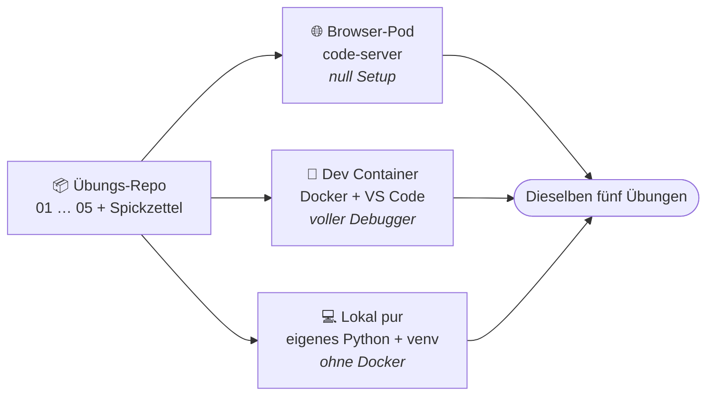

01 · Wie wir heute arbeiten

# Gleiche Aufgaben, freie Wahl der Umgebung.

Es gibt <strong>ein</strong> Übungs-Repo und drei Wege, es zu öffnen. Such dir den Weg aus,
der zu dir passt — die Aufgaben sind überall identisch.

  
Empfehlung

  
Einsteiger → Browser-Link (sofort startklar). Fortgeschrittene → lokal / Dev Container mit vollem GUI-Debugger.

<!--
Die wichtigste Botschaft des Tages: Ihr müsst euch nicht mit Setup aufhalten. Wer einfach
loslegen will, nimmt den Browser-Pod — Link aufrufen, Passwort eingeben, fertig. Wer es lokal
„richtig" will und Docker hat, nimmt den Dev Container — dort gibt es die echte MS-Python-
Extension, Pylance und den grafischen Debugger. Wer schon ein Python auf dem Rechner hat, kann
auch komplett lokal mit venv arbeiten. Wichtig für später: Im Browser-code-server gibt es den
GUI-Debugger NICHT (Open VSX statt MS-Marketplace) — dort debuggen wir über Terminal und pdb.
Das ist gleich bei Block 5 relevant. Einsteiger zum Browser-Link lotsen, Fortgeschrittene gern
lokal — die helfen dann auch am Tisch mit.
-->
