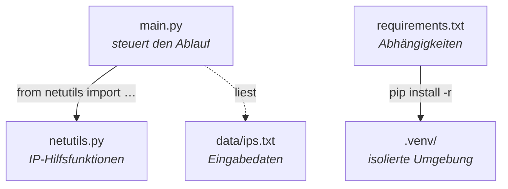

Block 4 · Ordnerstruktur & Module

# Ein Projekt hat eine Struktur.

<ul style="margin: 0; padding: 0; list-style: none; display: grid; gap: 18px; font-size: 22px; line-height: 1.4;">
  <li>main.py — der Einstieg, ruft die Bausteine auf.</li>
  <li>netutils.py — ein <strong>Modul</strong>: thematisch zusammengehörige Funktionen.</li>
  <li>data/ — Eingabedaten getrennt vom Code.</li>
  <li>requirements.txt — welche Bibliotheken das Projekt braucht.</li>
</ul>

  
Modul = Werkzeugkasten

  
Was woanders gebraucht wird, kommt in eine eigene Datei. import holt es herein.

<!--
Das entspricht dem echten Ordner 04_module/. Erkläre das Diagramm: main.py ist der Dirigent —
es importiert Funktionen aus netutils.py (from netutils import is_private, subnet_prefix) und
ruft sie auf. netutils.py ist ein Modul: ein Bündel zusammengehöriger Funktionen rund um
IP-Adressen, das man auch in anderen Skripten wiederverwenden könnte. Daten (ips.txt) liegen
getrennt vom Code im data/-Ordner — Code und Daten nicht vermischen. requirements.txt listet die
externen Bibliotheken; aus ihr installiert pip in die .venv. Die Leitfrage „was gehört in ein
eigenes Modul?": alles, was eine abgrenzbare Aufgabe hat und potenziell wiederverwendbar ist.
Faustregel wie bei Funktionen, nur eine Ebene höher.
-->
