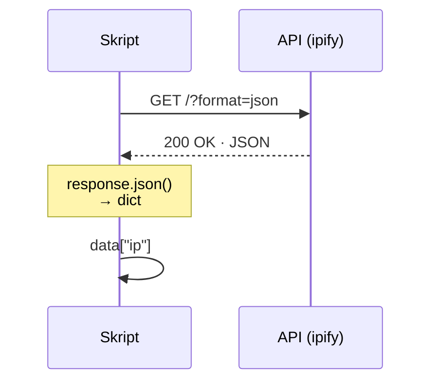

<div class="page-label">Block 5 · Eine REST-API abfragen</div>

# Mit der Außenwelt <span class="accent">reden</span><span class="dot">.</span>

<div style="display: grid; grid-template-columns: 1.15fr 0.85fr; gap: 40px; margin-top: 22px; align-items: start;">

<div>

```python {1|3-4|7-8|9|10|12|all}
import requests

URL = "https://api.ipify.org"
HEADERS = {"User-Agent": "netzwerk-workshop/1.0"}

def main() -> None:
    response = requests.get(URL, params={"format": "json"},
                            headers=HEADERS, timeout=10)
    response.raise_for_status()   # Fehler bei HTTP 4xx/5xx
    data = response.json()        # JSON -> dict

    print(f"Unsere öffentliche IP ist: {data['ip']}")
```

</div>

<div style="display: flex; justify-content: center;">



</div>

</div>

<div class="mantra" style="margin-top: 22px;">
  <div class="label">Drei Reflexe</div>
  <div class="text"><span class="mono">raise_for_status()</span> prüft den Status · <span class="mono">.json()</span> macht ein dict · <span class="mono">User-Agent</span> setzen = gute Etikette.</div>
</div>

<!--
Code aus 05_api_debug.py. Schritt für Schritt: import requests holt die Bibliothek (die wir in
Block 4 per pip installiert haben). URL und HEADERS als Konstanten — der User-Agent ist höfliche
API-Etikette und bei manchen APIs (z. B. GitHub) sogar Pflicht. Dann der eigentliche Aufruf:
requests.get mit timeout (NIE ohne Timeout, sonst hängt das Skript ewig). raise_for_status wirft
einen Fehler bei HTTP 4xx/5xx — so merkt man Probleme sofort, statt mit kaputten Daten weiter-
zurechnen. response.json() wandelt die JSON-Antwort in ein Python-dict um — und schon sind wir
wieder bei den Datentypen von heute Morgen. Das Sequenzdiagramm zeigt den Hin-und-Rück-Weg.
Proxy-Hinweis: im Firmennetz braucht requests evtl. HTTPS_PROXY (siehe Anhang).
-->
