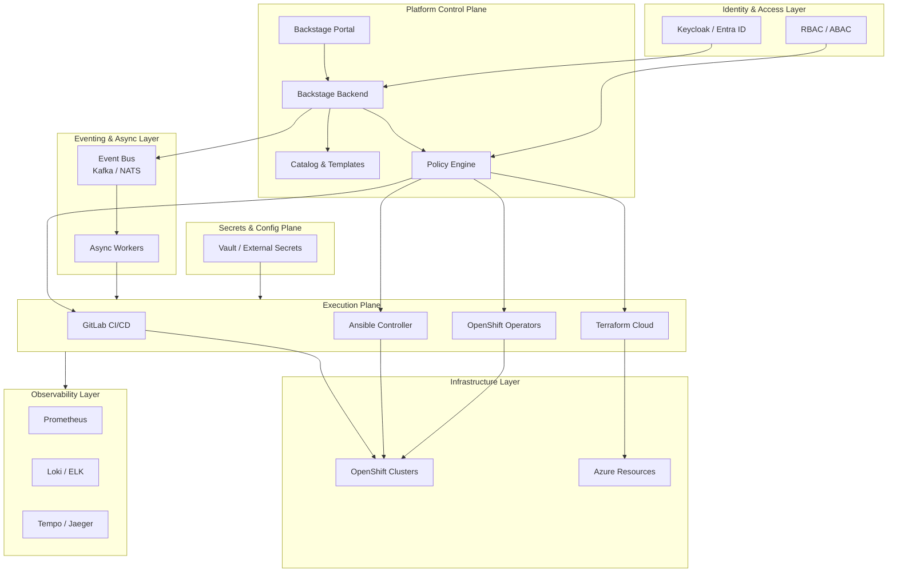

# Backstage Platform Architecture — Evolution & Maturity Model

---

## 1. Architecture Vision

**Backstage is not the platform — it is the control plane of the platform.**

* Enables self-service
* Enforces policy
* Orchestrates automation
* Provides visibility & governance

Everything else **executes**, **enforces**, **observes**, or **audits**.

---

## 2. Target Architecture Overview

---

## 3. Architecture Evolution — Phase 1

### Initial Adoption

**Characteristics**

* Backstage as a UI & catalog
* Manual approvals
* Direct API calls

**Tools**

* Backstage
* GitLab
* OpenShift

**Risks**

* Tight coupling
* Limited governance

---

## 4. Architecture Evolution — Phase 2

### Controlled Self-Service

**Characteristics**

* Software Templates
* CI/CD-driven automation
* Centralized identity

**Tools**

* Backstage Templates
* GitLab CI/CD
* Keycloak / Entra ID

**Improvements**

* Repeatability
* Reduced manual work

---

## 5. Architecture Evolution — Phase 3

### Policy-Driven Platform

**Characteristics**

* Policy as Code
* Async workflows
* Clear ownership

**Tools**

* OPA / Gatekeeper
* Kyverno
* Event Bus

**Benefits**

* Safe autonomy
* Compliance by default

---

## 6. Architecture Evolution — Phase 4

### Platform at Scale

**Characteristics**

* Observability-first
* FinOps integration
* Plugin lifecycle management

**Tools**

* Prometheus / Grafana
* Cost Management APIs
* Feature Flags

**Outcome**

* Predictable, scalable platform

---

## 7. Layer-to-Tool Mapping

| Layer             | Purpose            | Tools                      |
| ----------------- | ------------------ | -------------------------- |
| Control Plane     | UX & orchestration | Backstage                  |
| Identity & Policy | AuthZ / AuthN      | Keycloak, OPA              |
| Eventing          | Decoupling         | Kafka, NATS                |
| Execution Plane   | Automation         | GitLab, Ansible, Terraform |
| Infrastructure    | Runtime            | OpenShift, Azure           |
| Observability     | Visibility         | Prometheus, Loki, Tempo    |
| Secrets           | Zero-trust         | Vault, External Secrets    |

---

## 8. Anti-Patterns — Control Plane

❌ Backstage triggers infra changes directly
❌ Business logic embedded in plugins
❌ No approval or policy checks

✅ Backstage orchestrates, never executes

---

## 9. Anti-Patterns — Identity & Policy

❌ Hardcoded permissions
❌ Tool-specific RBAC only
❌ No audit trail

✅ Central identity + policy as code

---

## 10. Anti-Patterns — Eventing

❌ Synchronous long-running tasks
❌ Plugins blocking the backend
❌ Tight coupling between tools

✅ Async, event-driven workflows

---

## 11. Anti-Patterns — Observability

❌ No metrics for plugins
❌ Logs only at infrastructure level
❌ No SLOs

✅ Full-stack observability

---

## 12. Anti-Patterns — Secrets

❌ Secrets in Git
❌ Secrets passing through Backstage
❌ No rotation

✅ Runtime-only secret injection

---

## 13. Anti-Patterns — Catalog Governance

❌ No owners
❌ Stale services
❌ Unlimited growth

✅ Ownership, lifecycle & validation

---

## 14. Anti-Patterns — FinOps

❌ Cost visibility outside platform
❌ No quotas or budgets
❌ No accountability

✅ Cost tied to ownership & metadata

---

## 15. Key Takeaways

* Backstage is a **control plane**, not a workflow engine
* Policies, events, and observability are mandatory at scale
* Architecture must evolve incrementally
* Governance enables, not blocks, self-service

---

## 16. Final Message

**A successful internal developer platform is:
Self-service by default, governed by design, and observable end-to-end.**
