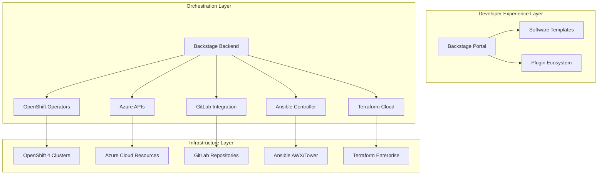

# /Architecture

---

### /Overview

---

### /Architectural Mistakes

✅ Do:

* Use external authentication provider
* Implement secrets management
* Automated backup strategy
* Regular dependency updates
* Extend via plugins

❌ Don't:

* Run without authentication in production
* Store secrets in Git repositories
* Skip database backups
* Ignore security updates
* Over-customize core functionality

--

### /Operational Issues

Common Problems:
* Resource Exhaustion
* Insufficient database connections
* Memory leaks in plugins
* Unbounded catalog growth

Performance Degradation:
* Missing database indexes
* No caching strategy
* Synchronous heavy operations

--

### /Security Gaps

Overly permissive CORS
Missing rate limiting
Inadequate audit logging

--

### /Plugin Ecosystem Challenges

Avoid:

Too many plugins at once
Unmaintained third-party plugins
Tightly coupled plugins
Plugins with different tech stacks

Instead:

Curated plugin registry
Version compatibility matrix
Plugin health monitoring
Standardized development practices

--

Future Considerations
Preparing for evolution
--
Emerging Patterns
Platform Engineering:

GitOps for everything
Progressive delivery
Policy as code
FinOps integration

AI/ML Integration:

Intelligent service recommendations
Automated documentation
Predictive scaling
Code generation assistance

--
Roadmap Items
Community Directions:

Enhanced plugin framework
Better multi-tenancy support
GraphQL API layer
Mobile application support
Real-time collaboration features

Your Roadmap:

Assess current state
Define success metrics
Plan incremental improvements
Regular retrospectives