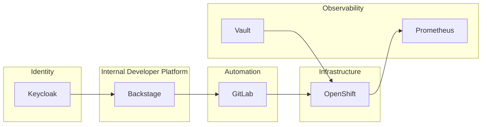

### Backstage Platform Architecture

---

## Architecture Vision

**Backstage is not the platform — it is the control plane of the platform.**

* Enables self-service
* Enforces policy
* Orchestrates automation
* Provides visibility & governance

Everything else **executes**, **enforces**, **observes**, or **audits**.

---

### When to Invest in Platform Engineering

<!--  -->

| Signal | Description |
|--------|-------------|
| 👥 Team Size | ~50 engineers OR rapid growth toward that number |
| 🔧 Infra Friction | Long onboarding, many infra tickets, inconsistent CI/CD |
| 🔁 Duplication | Many similar services (microservices) with duplicated build/deploy logic |
| 🛡️ Governance | Need for self-service and audited defaults (security, compliance) |

---

### Pitfalls to Avoid

| Pitfall | How to Prevent |
|---------|----------------|
| 🔒 "Golden Cage" | Don't be too rigid — allow escape hatches |
| 🏗️ Over-engineering | Start with real needs, not hypothetical ones |
| 📚 Poor Docs | No docs = no adoption — invest in onboarding |
| 🎯 Big Bang | Start small, measure, iterate based on usage |

> **Mindset shift:** Treat platform as a product — assign a PM + support rota

---

### PLATFORM TEAMS

---

### TEAM SIZING

- < 30 devs: No dedicated platform org usually — 1–2 infra/DevOps engineers embedded in teams
- ~30–100 devs: 2–6 people focused on platform features + templates (part-time or small team)
- 100–500 devs: 6–20 FTEs running IDP, pipelines, service catalog, observability
- 500+ devs: Platform becomes a full product org (20+), with SLAs, PMs, SREs, UX

---

## Helpful Questions

- Can you reduce feedback loops? (pair /peer programming)
- Where is cognitive load highest?
- Which teams need support?
- What would great DX look like?

---

## Target Architecture Overview

**Backstage** → **Automation** → **Infrastructure**

| Layer | What it does |
|-------|--------------|
| Control Plane | Backstage (UI, catalog, templates) |
| Execution | GitLab, Ansible, Terraform |
| Infrastructure | OpenShift, Azure |

---

### Architecture Evolution Overview

| Phase | Name | Focus |
|-------|------|-------|
| 1 | Initial Adoption | Get started |
| 2 | Controlled Self-Service | Automate |
| 3 | Policy-Driven | Govern |
| 4 | Platform at Scale | Optimize |

---

### Phase 1 — Initial Adoption

| Aspect | Details |
|--------|---------|
| **Goal** | Get Backstage running as UI & catalog |
| **Characteristics** | Manual approvals, direct API calls |
| **Tools** | Backstage, GitLab, OpenShift |
| **Risks** | Tight coupling, limited governance |

---

### Phase 2 — Controlled Self-Service

| Aspect | Details |
|--------|---------|
| **Goal** | Enable repeatable, automated workflows |
| **Characteristics** | Software Templates, CI/CD-driven, centralized identity |
| **Tools** | Backstage Templates, GitLab CI/CD, Keycloak |
| **Outcome** | Repeatability, reduced manual work |

---

### Phase 3 — Policy-Driven Platform

| Aspect | Details |
|--------|---------|
| **Goal** | Enforce governance without blocking teams |
| **Characteristics** | Policy as Code, async workflows, clear ownership |
| **Tools** | OPA / Gatekeeper, Kyverno, Event Bus |
| **Outcome** | Safe autonomy, compliance by default |

---

### Phase 4 — Platform at Scale

| Aspect | Details |
|--------|---------|
| **Goal** | Sustainable, cost-aware platform operations |
| **Characteristics** | Observability-first, FinOps, plugin lifecycle |
| **Tools** | Prometheus / Grafana, Cost Management APIs, Feature Flags |
| **Outcome** | Predictable, scalable platform |

---

## Layer-to-Tool Mapping

| Layer | Tools |
|-------|-------|
| Control | Backstage |
| Identity | Keycloak, OPA |
| Execution | GitLab, Ansible, Terraform |
| Infrastructure | OpenShift, Azure |
| Observability | Prometheus, Loki |
| Secrets | Vault |

---
<!--
## Anti-Patterns

| Area | Don't | Do |
|------|-------|-----|
| **Control Plane** | Direct infra changes, logic in plugins | Orchestrate, never execute |
| **Identity** | Hardcoded permissions, no audit | Central identity + policy as code |
| **Eventing** | Sync long-running tasks, tight coupling | Async, event-driven workflows |
| **Observability** | No plugin metrics, no SLOs | Full-stack observability |
| **Secrets** | Secrets in Git, no rotation | Runtime-only injection |
| **Catalog** | No owners, stale services | Ownership & lifecycle validation |
| **FinOps** | No quotas, no accountability | Cost tied to ownership

--- -->

## Lessons Learned

- **Provide Templates for Documentation**
  - Ensure consistent documentation and clear documentation structures
  - Reduce effort for developers and faster documentation creation
  - Increase completeness and clarity
- **Support Linting**
  - Increase the quality
  - Catch errors early
  - Provide a reusable jobs for CI/CD
  - Provide documentation
- **Provide Silver Path**

---

## Key Takeaways

* Backstage is a **control plane**, not a workflow engine
* Policies, events, and observability are mandatory at scale
* Architecture must evolve incrementally
* Governance enables, not blocks, self-service

---

## Final Message

**A successful internal developer platform is:
Self-service by default, governed by design, and observable end-to-end.**
