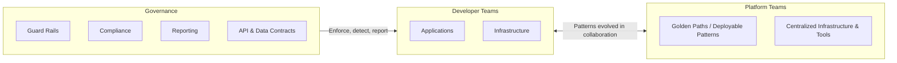
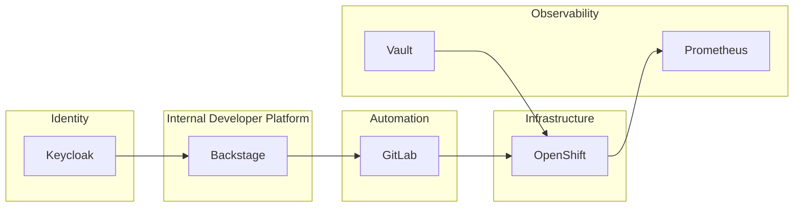

### Backstage Platform Architecture

---


## Start With These Questions

| Question | Why It Matters |
|----------|----------------|
| Can you reduce feedback loops? | Faster iteration = happier developers |
| Where is cognitive load highest? | Target your platform investment |
| Which teams need the most support? | Prioritize high-impact improvements |
| What would great DX look like? | Define your north star |

---

### When to Invest in Platform Engineering

| Signal | Description |
|--------|-------------|
| 👥 Team Size | ~50 engineers OR rapid growth toward that number |
| 🔧 Infra Friction | Long onboarding, many infra tickets, inconsistent CI/CD |
| 🔁 Duplication | Many similar services (microservices) with duplicated build/deploy logic |
| 🛡️ Governance | Need for self-service and audited defaults (security, compliance) |

---

### Pitfalls to Avoid

| Pitfall | How to Prevent |
|---------|----------------|
| 🔒 "Golden Cage" | Don't be too rigid — allow escape hatches |
| 🏗️ Over-engineering | Start with real needs, not hypothetical ones |
| 📚 Poor Docs | No docs = no adoption — invest in onboarding |
| 🎯 Big Bang | Start small, measure, iterate based on usage |

> **Mindset shift:** Treat platform as a product — assign a PM + support rota

---

### IDP Team Collaboration Model



| Team | Responsibility |
|------|----------------|
| **Developer Teams** | Consume patterns, build applications & infrastructure |
| **Platform Teams** | Provide golden paths, centralized infra & collaboration tools |
| **Governance** | Enforce guard rails, compliance, reporting & contracts |

---

### Platform Teams Overview


---

### Platform Team Sizing Guide

| Org Size | Platform Team | Focus |
|----------|---------------|-------|
| < 30 devs | 1–2 embedded engineers | Basic automation, shared tooling |
| 30–100 devs | 2–6 people (part-time/small team) | Templates, CI/CD standardization |
| 100–500 devs | 6–20 FTEs | Full IDP, pipelines, catalog, observability |
| 500+ devs | 20+ (full product org) | SLAs, PMs, SREs, UX, dedicated support |

---

## Architecture Vision

**Backstage is not the platform — it is the control plane of the platform.**

* Enables self-service
* Enforces policy
* Orchestrates automation
* Provides visibility & governance

Everything else **executes**, **enforces**, **observes**, or **audits**.

---

#### High-level Goals of the Dev Architecture

| Goal | Description |
|------|-------------|
| 🔌 Fast Local Development | Hot-reload, instant feedback, minimal setup time |
| 🔁 App/Plugin Separation | Independent versioning, clear boundaries, pluggable architecture |
| 🧪 Automated Testing | Unit, integration, e2e tests + ephemeral preview environments per PR |
| 🚀 Safe Promotion | Staged rollouts: Preview → Staging → Production with gates |
| 🔐 Secure Secrets | No secrets in code, runtime injection via Vault/K8s secrets |
| 📦 Repeatable Builds | Deterministic builds, pinned dependencies, immutable artifacts |

---

#### Logical Architecture Overview

```
┌────────────────────────────────────────────────────────────┐
│                       DEVELOPERS                           │
│                                                            │
│  ┌─────────────────┐      ┌─────────────────────────────┐  │
│  │   Local Dev     │      │   IDE (VSCode)              │  │
│  │   (yarn dev)    │◄────►│   - Backstage monorepo      │  │
│  │                 │      │   - Plugin development      │  │
│  └────────┬────────┘      │   - API contracts           │  │
│           │               └─────────────────────────────┘  │
└───────────┼────────────────────────────────────────────────┘
            │ git push
            ▼
┌────────────────────────────────────────────────────────────┐
│                    SOURCE CONTROL                          │
│                                                            │
│   GitHub / GitLab                                          │
│   ├── backstage-app repo                                   │
│   ├── plugins (monorepo or multi-repo)                     │
│   └── catalog-info.yaml                                    │
└───────────┬────────────────────────────────────────────────┘
            │ webhook trigger
            ▼
┌────────────────────────────────────────────────────────────┐
│                   CI/CD PIPELINE                           │
│                                                            │
│   GitHub Actions / GitLab CI                               │
│   ├── Lint & Test                                          │
│   ├── Build Backstage app                                  │
│   ├── Build container image                                │
│   ├── Publish artifacts (registry)                         │
│   └── Deploy to preview / staging                          │
└───────────┬────────────────────────────────────────────────┘
            │ deploy
            ▼
┌────────────────────────────────────────────────────────────┐
│                RUNTIME ENVIRONMENTS (K8s)                  │
│                                                            │
│   ┌────────────┐   ┌────────────┐   ┌────────────────┐     │
│   │  Preview   │   │  Staging   │   │  Production    │     │
│   │  (per PR)  │──►│            │──►│                │     │
│   └────────────┘   └────────────┘   └────────────────┘     │
│                                                            │
│   Components:                                              │
│   ├── Backstage backend + frontend                         │
│   ├── PostgreSQL                                           │
│   ├── Auth (Keycloak / GitHub OAuth)                       │
│   └── Ingress / TLS                                        │
└────────────────────────────────────────────────────────────┘
```

---

## Target Architecture Overview

**Backstage** → **Automation** → **Infrastructure**

| Layer | What it does |
|-------|--------------|
| Control Plane | Backstage (UI, catalog, templates) |
| Execution | GitLab, Ansible, Terraform |
| Infrastructure | OpenShift, Azure |



---


## OpenShift Developer Hub vs. Backstage

| | Backstage | RHDH |
|---|-----------|------|
| **Origin** | CNCF project (Spotify) | Red Hat enterprise distribution |
| **Relationship** | Upstream OSS framework | Built directly on Backstage |
| **Model** | Community-driven | Commercially supported |

> **Think of it like:**
> - Kubernetes → OpenShift
> - Linux Kernel → RHEL

{}
RHDH is not a fork — it's built directly on Backstage with additional enterprise features and support.
{}

---

### Installation & Management

| Aspect | Backstage | RHDH |
|--------|-----------|------|
| **Deployment** | Manual setup | Kubernetes Operator / Helm |
| **Build Process** | Complex, DIY | Simplified, pre-built |
| **Dependencies** | Self-managed | Bundled & validated |
| **Updates** | Manual maintenance | Automated |
| **Plugin Loading** | Static (rebuild required) | Dynamic (hot-reload) |

{}
RHDH eliminates the "undifferentiated heavy lifting" of deploying Backstage on Kubernetes.
{}

---

### RHDH: Pre-Integrated Ecosystem

RHDH ships with ready-to-use integrations optimized for the OpenShift/Red Hat ecosystem:

| Category | Integration |
|----------|-------------|
| 🔍 **Visualization** | Application Topology for Kubernetes |
| 🔧 **CI/CD** | Tekton Pipelines |
| 🚀 **GitOps** | Argo CD (OpenShift GitOps) |
| 📦 **Registry** | Quay container registry |
| 🌐 **Multi-Cluster** | Open Cluster Manager |
| 🔐 **Auth** | Keycloak authentication |

---

### Plugin Architecture Comparison

| | Backstage (Static) | RHDH (Dynamic) |
|---|-------------------|----------------|
| **Adding Plugins** | Rebuild app | Configure & reload |
| **Updates** | Redeploy required | Hot-reload capability |
| **Downtime** | Yes, for changes | Zero-downtime updates |
| **Flexibility** | Full control | Curated plugin set |

---

### Golden Path Templates

RHDH provides **pre-defined, Red Hat-validated templates** that accelerate adoption:

| Benefit | Description |
|---------|-------------|
| 📐 **Pre-architected** | Proven patterns out of the box |
| ⚡ **Optimized** | OpenShift-native workflows |
| 🔒 **Secure** | Security best practices built-in |
| 🚀 **Fast** | Reduced time-to-production |

---

### Decision Guide

| Choose **Backstage** when... | Choose **RHDH** when... |
|------------------------------|-------------------------|
| ✅ Maximum flexibility needed | ✅ Faster time-to-value required |
| ✅ Resources to build & maintain | ✅ Already invested in OpenShift/Red Hat |
| ✅ Plugins outside Red Hat ecosystem | ✅ Enterprise support & SLAs needed |
| ✅ Community-driven development | ✅ Want curated, validated plugins |
| ✅ Full control over the platform | ✅ Simplified RBAC & compliance |
| | ✅ Less operational overhead |

---

### Architecture Evolution Overview

| Phase | Name | Focus |
|-------|------|-------|
| 1 | Initial Adoption | Get started |
| 2 | Controlled Self-Service | Automate |
| 3 | Policy-Driven | Govern |
| 4 | Platform at Scale | Optimize |

---

### Phase 1 — Initial Adoption

| Aspect | Details |
|--------|---------|
| **Goal** | Get Backstage running as UI & catalog |
| **Characteristics** | Manual approvals, direct API calls |
| **Tools** | Backstage, GitLab, OpenShift |
| **Risks** | Tight coupling, limited governance |

---

### Phase 2 — Controlled Self-Service

| Aspect | Details |
|--------|---------|
| **Goal** | Enable repeatable, automated workflows |
| **Characteristics** | Software Templates, CI/CD-driven, centralized identity |
| **Tools** | Backstage Templates, GitLab CI/CD, Keycloak |
| **Outcome** | Repeatability, reduced manual work |

---

### Phase 3 — Policy-Driven Platform

| Aspect | Details |
|--------|---------|
| **Goal** | Enforce governance without blocking teams |
| **Characteristics** | Policy as Code, async workflows, clear ownership |
| **Tools** | OPA / Gatekeeper, Kyverno, Event Bus |
| **Outcome** | Safe autonomy, compliance by default |

---

### Phase 4 — Platform at Scale

| Aspect | Details |
|--------|---------|
| **Goal** | Sustainable, cost-aware platform operations |
| **Characteristics** | Observability-first, FinOps, plugin lifecycle |
| **Tools** | Prometheus / Grafana, Cost Management APIs, Feature Flags |
| **Outcome** | Predictable, scalable platform |

---


### Tactics - How to promote Backstage internally:

- **"Lunch & Learns" & seminars**
  - show, for example, how to build a plugin from scratch
- **Hack days**
  - fun way to get people into plugin development
- **Show & tell meetings**
  - quarterly meetings where anyone working on Backstage is invited to present their work
- **Pro-actively identify new plugins**
  - reach out to teams that own internal user interfaces or platforms that you think would make sense to consolidate into Backstage

---

## Lessons Learned

- **Provide Templates for Documentation**
  - Ensure consistent documentation and clear documentation structures
  - Reduce effort for developers and faster documentation creation
  - Increase completeness and clarity
- **Support Linting**
  - Increase the quality
  - Catch errors early
  - Provide a reusable jobs for CI/CD
- **Provide Silver Path**
  - Offer alternative paths when golden path doesn't fit
  - Document trade-offs and when to deviate
  - Enable flexibility without chaos

---

## Key Takeaways

* Backstage is a **control plane**, not a workflow engine
* Policies, events, and observability are mandatory at scale
* Architecture must evolve incrementally
* Governance enables, not blocks, self-service

---

## Final Message

**A successful internal developer platform is:
Self-service by default, governed by design, and observable end-to-end.**
